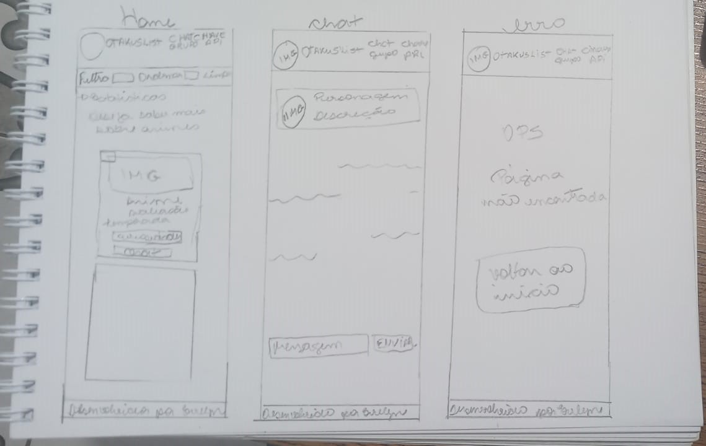
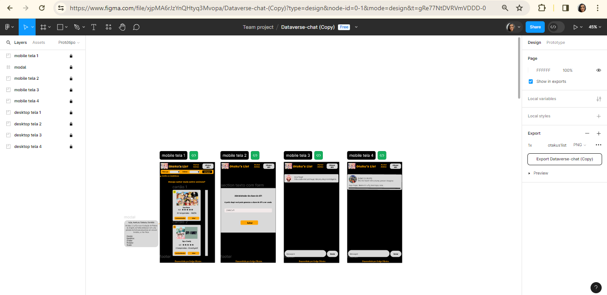
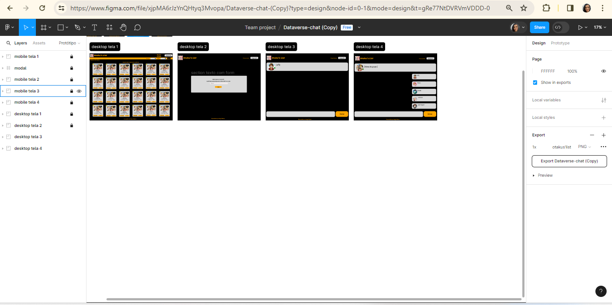
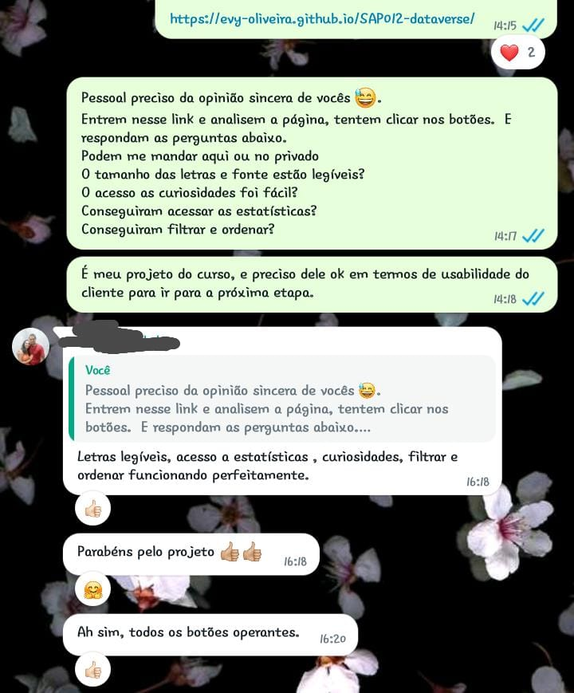
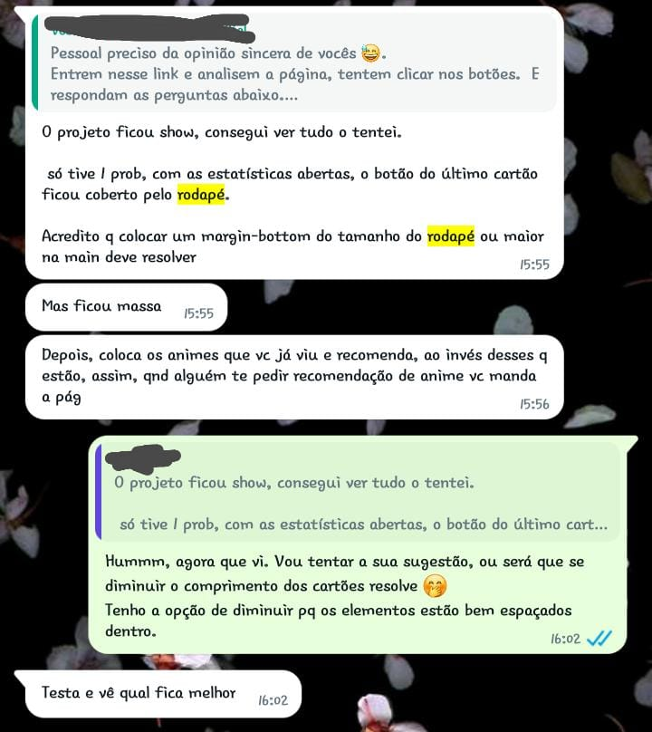
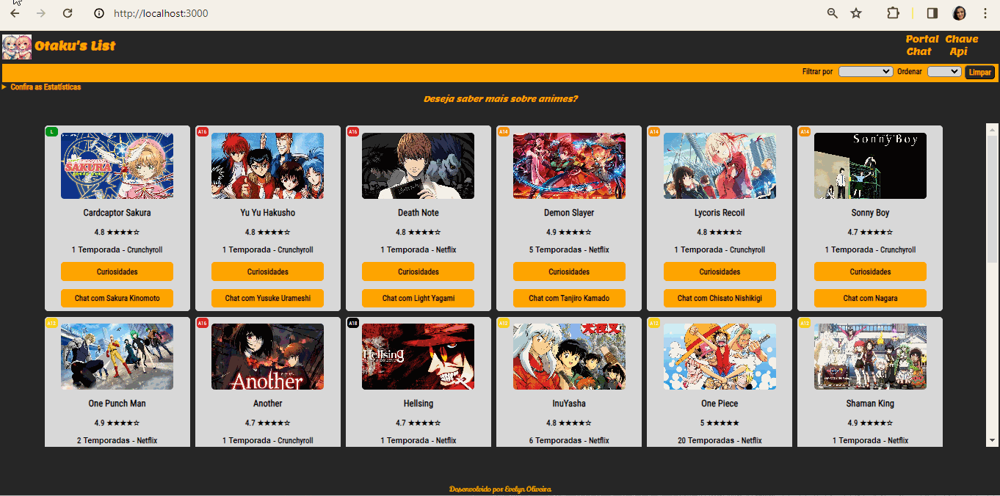
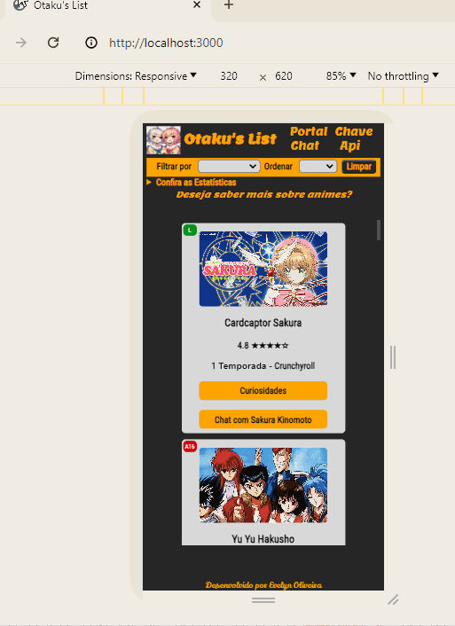

<h1 align="center"> Dataverse Chat  - Otaku's List </h1>

<p align="center">
  
 </p>

## Índice 
* [Título](#Título)
* [Badges](#badges)
* [Índice](#índice)
* [Descrição do Projeto](#descrição-do-projeto)
* [Sbre o Projeto](#sobre-o-projeto)
* [Status do Projeto](#status-do-Projeto)
* [Funcionalidades e Demonstração da Aplicação](#funcionalidades-e-demonstração-da-aplicação)
* [Acesso ao Projeto](#acesso-ao-projeto)
* [Tecnologias utilizadas](#tecnologias-utilizadas)
* [Testes](#testes)
* [Desenvolvedora](#desenvolvedora)
* [Conclusão](#conclusão)

***
## Descrição
O objetivo dessa aplicação é conceder ao usuario a experiência de navegar em uma página com uma seleção de animes e ver suas curiosidades. Além de poder filtrar, ordenar e ver estatiscas, o usuario pode conversar com o protagonista desse anime, e isso foi possivel com o uso da API do OpenAi.

***
## Sobre o Projeto

````
O objetivo do projeto é desenvolver uma Single Page Application (SPA) que apresente aos usuários um compilado de animes em forma de cards, permitindo acesso a informações como curiosidades, onde assistir, etc. Os principais pontos do projeto incluem:

Desenvolvimento de uma SPA.
Aplicação dos conceitos de responsividade para garantir uma boa experiência em diferentes dispositivos.
Implementação de um router para facilitar a navegação entre as diferentes visualizações/telas da aplicação.
Integração de uma API externa para obtenção de dados sobre os animes.
Compreensão e aplicação dos conceitos de assincronia em JavaScript.
Criação de um conjunto de testes unitários que permitam testar código assíncrono.

````
**Definição do produto** - O produto consiste em uma plataforma que oferece aos usuários um catálogo de animes apresentados em cards, onde é possível acessar diversas informações relacionadas, como curiosidades e plataformas de streaming. As histórias de usuários foram criadas com base nas necessidades identificadas.

**Design da interface** - Foram desenvolvidos protótipos de baixa e média fidelidade para o design da interface. Os protótipos de baixa fidelidade foram feitos manualmente, enquanto os de média fidelidade foram elaborados no Figma. Estes representam a solução ideal, incluindo elementos como chat em grupo, que serão trabalhados posteriormente.

* Protótipo de Baixa Fidelidade:

| [](src/assets/prototipoBaixaFidelidade.jpg.jpg)|
| :---: |

* Protótipo de Média Fidelidade(mobile)

| [](src/assets/prototipoMobile.png)|
| :---: |

* Protótipo de Média Fidelidade(Desktop)

| [](src/assets/prototipoDesktop.png)|
| :---: |

**Teste de usabilidade** - Um teste de usabilidade foi conduzido com alguns usuários utilizando uma versão anterior do projeto. Durante o teste, foi identificado um problema em que o último card ficava sobrepondo o rodapé ao abrir as estatísticas. Foi necessário ajustar a altura dos elementos no CSS para resolver esse problema.

* Imagens dos feedbacks do teste de usabilidade:

| [](src/assets/feedback.jpg)|
| :---: |

| [](src/assets/feedback1.jpg)|
| :---: |

| [](src/assets/feedback2.jpg)|
| :---: |


***
## Status do Projeto
<h4 align="center">✨Concluído✨</h4>

***
## :hammer: Funcionalidades do Projeto
👍🏼 A aplicação tem as seguintes funcionalidades:

````
📌Visualizar: o usuario tem acesso os animes em cards .
📌Fitrar: é possível filtrar os animes por stremming .
📌Ordenar: em cima dos animes filtrados ou não, é possível ordenar de A/Z e Z/A.
📌Analisar Estatísticas: O usuario consegue verificar a porcentagem de animes de acordo com a classificação idicativa.
📌Limpar dados: é possível limpar os dados filtrados/ordenados sem recarrecar a página.
📌Interação com API: o usuário usa uma API Key para interagir com a API da Open AI e isso permite que converse com um personagem através do chat.
📌Redirecionar: caso o usuario esteja no chat e queira voltar a página inicial, é possível clicando no titulo da pagina. E caso, digite um endereço incompleto ou inexistente ele é redirecionado para a página de erro.
````

| [](src/assets/otaku'sListDesktop.gif)|
| :---: |

| [](src/assets/otakusListMobile.gif)|
| :---: |

***
## 📁 Acesso ao projeto

**Deploy da Aplicação**
[Otaku's List](https://otakus-list.netlify.app/)

### 🛠️ Abrir e rodar o projeto

**Pré-requisitos**
[Git](https://git-scm.com/)
[GitHub](https://github.com/)
[Node.js](https://nodejs.org/en)
<p>Faça o fork do repositórito e no terminal, clone o projeto:

```
https://github.com/Evy-Oliveira/SAP012-dataverse-chat
```
Instale as dependências com **npm install**
Se tudo estiver certo, poderá executar o teste **npm test**
Use o comando **npm start**, para iniciar o servidor e visualizar a interface.
</p>


***
## Tecnologias Utilizadas

👉🏼 [Html](https://html.spec.whatwg.org/)
👉🏼 [Css](https://developer.mozilla.org/pt-BR/docs/Web/CSS)
👉🏼 [JavaScript](https://www.freecodecamp.org/portuguese/news/o-manual-de-javascript-para-iniciantes/)
👉🏼 [Node.js](https://nodejs.org/en)
👉🏼 [Git](https://git-scm.com/)
👉🏼 [GitHub](https://github.com/)
👉🏼 [Jest](https://jestjs.io/)
👉🏼 [Netlify](https://www.netlify.com/)
👉🏼 [Vercel](https://vercel.com/)


****
## 🔎Testes🔍
```
npm run pretest
```
```
npm run test
```
```
npm run test:e2e
```


***
## Conclusão

Desenvolver um projeto é sempre desafiador. Este me proporcionou uma jornada intensa e repleta de superações. A divisão do projeto em marcos e funcionalidades foi fundamental, assim pude me concentrar em problemas menores um de cada vez, e seguir o cronograma.
Conquistei uma série de objetivos de aprendizagem como uso do HTML semântico para tornar a estrutura do meu conteúdo mais compreensível e acessível. No que diz respeito ao CSS, explorei os seletores de css e compreendi o funcionamento do modelo de caixa. Além disso, aprendi a utilizar flexbox para criar layouts flexíveis e responsivos.

Me dediquei para entender o DOM, e aprendi a manipular seus elementos e eventos para conseguir fazer alterações no conteúdo da página de maneira eficaz. Em JavaScript, expandi meus conhecimentos abordando variáveis, condicionais, funções e laços, que são essenciais para a lógica e fluxo de controle do código. Além disso comecei a estudar sobre assicronicidade, callbacks e promessas o que me permitiu lidar com operações assicronas e melhorar a experiência do usuário.

Explorando outros aspectos técnicos, comecei a compreender a diferença entre tipos de dados primitivos e não primitivos, bem como manipulei Arrays e Objetos. Aprendi sobre módulos e como posso tornar meu código mais organizado e modular.
Nos testes em JavaScript, explorei testes unitários e assíncronos, utilizei mocks e espiões para garantir a segurança no meu código. Em relação ao HTTP, estudei sobre o funcionamento de cabeçalhos, consultas e respostas.


***
## Desenvolvedora

| [<br><sub>Evelyn Oliveira</sub>](https://github.com/Evy-Oliveira) |  
| :---: |
